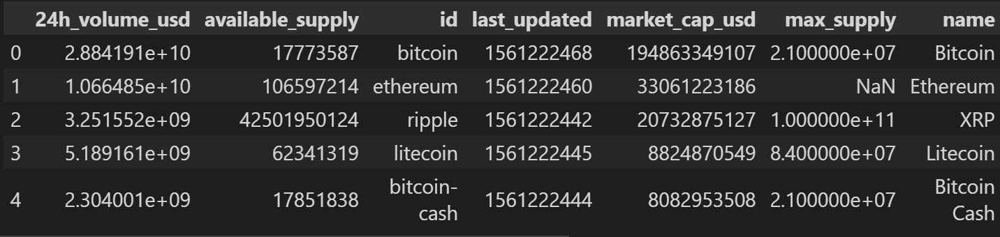
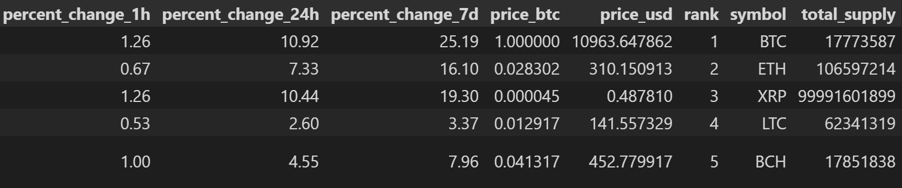
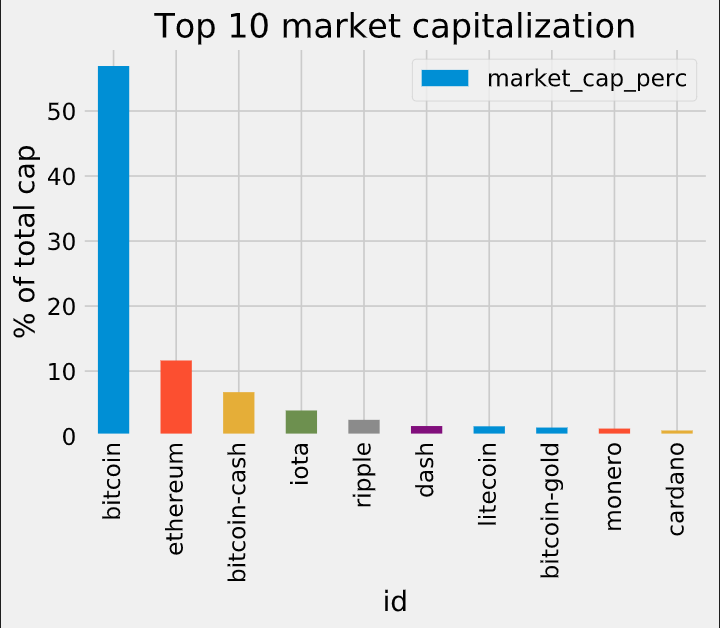

# mini_projet_GLA

## Présentation

ceci est un presentation de projet en analyse de donnée
on a utilisé la bibliothèque pandas

## :file_folder: Dataset 

## Analyse
:point_right:<h1>full Dataset,Filtering and Reproducibility</h1>

              id              |  1326

             market_cap_usd   | 1031

             dtype: int64

:point_right:<h1> 4. How big is Bitcoin compared with the rest of the cryptocurrencies?</h1>

## :white_check_mark:Conclusion 

<h1>10. Most coins are tiny</h1>

Note that many coins are not comparable to large companies in market cap, so let's divert from the original Investopedia definition by merging categories.

<em>This is all for now. Thanks for completing this project!</em>

